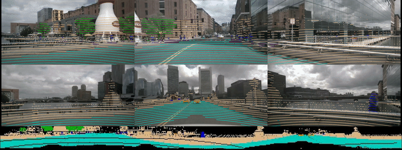

# DLA_ATTN_Net

Source code will be available soon.

The visulization results can be found here:

# Results on nuScenes Benchmark
Quantitative results on nuScenes Benchmark compared to state-of-the-art methods are:

|   Method       | Parameters[M] | mIoU | car | pedistrian| bicycle | motorcycle | bus | truck | const. vehicle | trailer | barrier | traffic cone | drive. surface | other flat | sidewalk | terrain | manmade | vegetation |
| ---------------|--------------|------|-----|-----------|---------|------------|-----|-------|----------------|---------|---------|--------------|----------------|------------|----------|---------|---------|------------|
| RangeNet++     | 50.4       | 65.5 | 80.9| 69.6      | 21.3    | 66.8       | 77.2| 72.3  | 30.2           | 54.2    | 66.0    | 52.1         | 94.1           | 66.6       | 63.5     | 70.1    | 83.1    | 79.8       |
| PolarNet       | 14.0       | 71.0 | **90.9**| 71.3      | 28.2    | 77.5       | 85.3| 76.1  | 35.1           | 57.4    | 74.7    | 58.8         | 96.5           | **71.1**       | 74.7     | 74.0    | 87.3    | 85.7       |
| Salsanext      | **7.1**        | 72.2 | 88.4| 72.2      | 34.1    | 72.4       | 85.9| 76.5  | 42.2           | 61.3    | 74.8    | 63.1         | 96.0           | 70.8       | 70.8     | 71.5    | 86.7    | 84.4       |
| Ours           | 8.1        | **75.4** | 90.5| **75.1**      | **35.3**    | **77.5**       | **92.0**| **84.0**  | **51.1**           | **66.8**    | **77.1**    | **63.2**         | **96.5**           | 70.4       | **75.2**     | **74.9**    | **89.3**    | **87.8**       |

<!--  -->
<!--  -->

